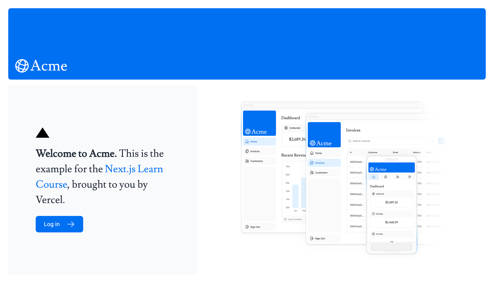
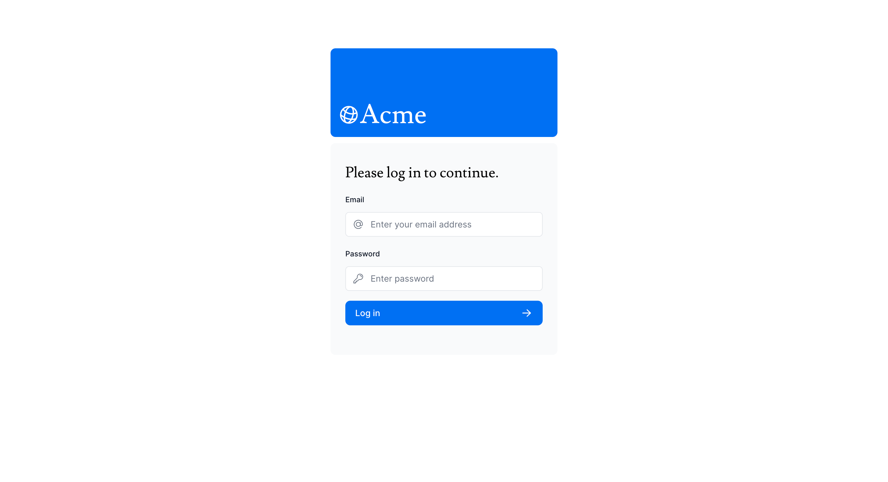
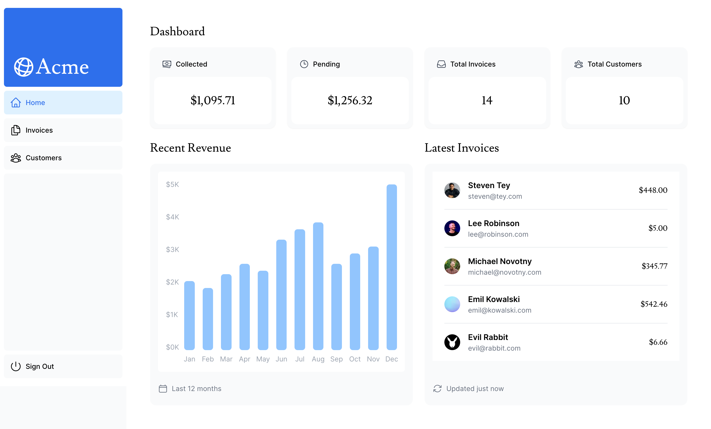
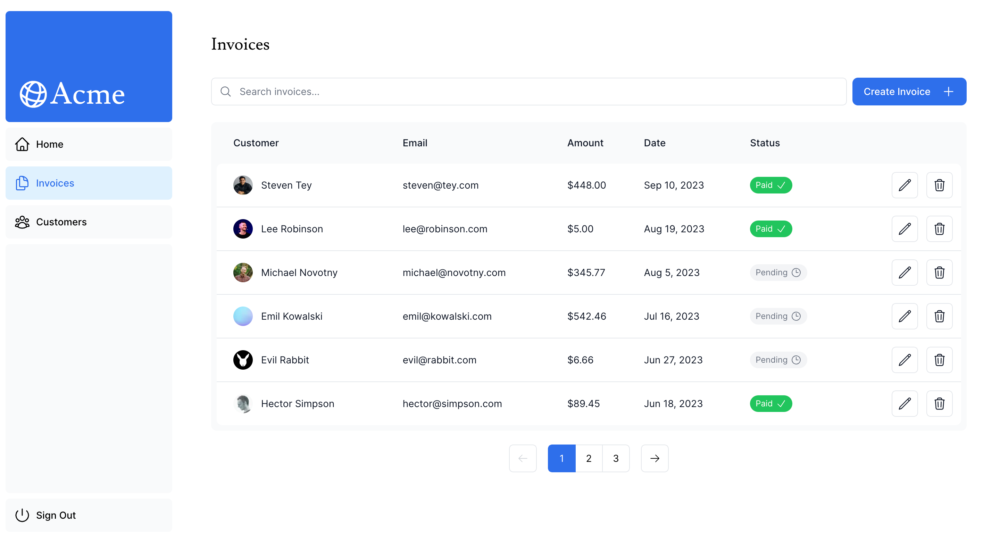
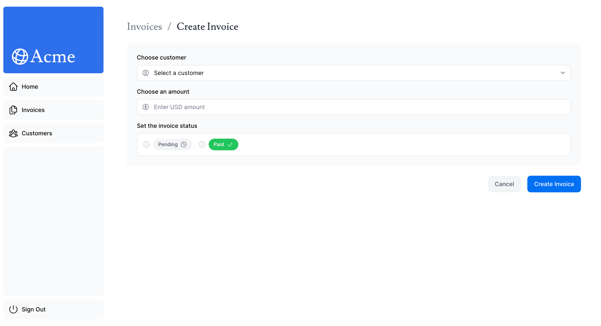
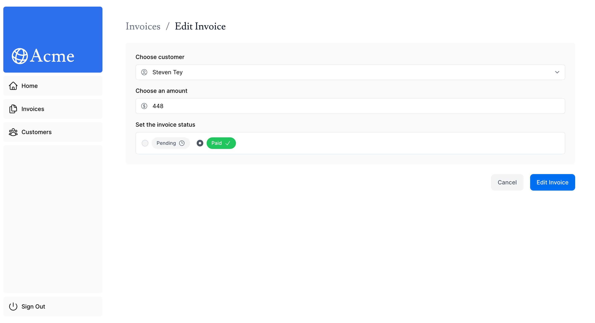
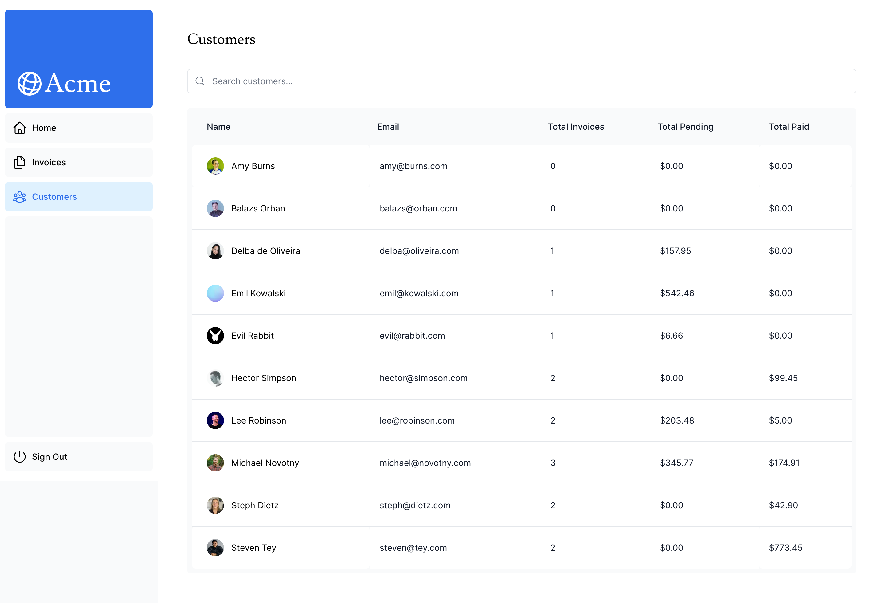

# Next.js Acme Financial Dashboard Page

This repository contains a responsive dashboard built with Next.js framework, designed for visualizing and managing data effectively.

## Table of Contents

- [Screenshots](#screenshots)
- [Features](#Features)
- [Built With](#built-with)
- [Login Credentials](#login-credentials)
- [Author](#author)

## Screenshots

### Home Page

### Login Page

### Dashboard Page

### Invoices Page

### Create Invoice Page

### Edit Invoice Page

### Customers Page

## Features

- **Modern UI:** Clean and intuitive interface designed with React and Tailwind CSS.
- **Responsive:** Ensures a seamless experience across devices of all sizes.
- **Data Visualization:** Charts and graphs to present data insights.
- **Customizable:** Easily adaptable components for your specific needs.
- **Authentication:** Basic authentication setup for demo purposes.

## Built With

- **Next.js 14**
- **TypeScript**
- **PostgreSQL**
- **Tailwind CSS**
- **Google Fonts**

## Login Credentials

- Email: user@nextmail.com
- Password: 123456

## Author

**LinkedIn**: [/in/mohaamin](https://www.linkedin.com/in/mohaamin/)
